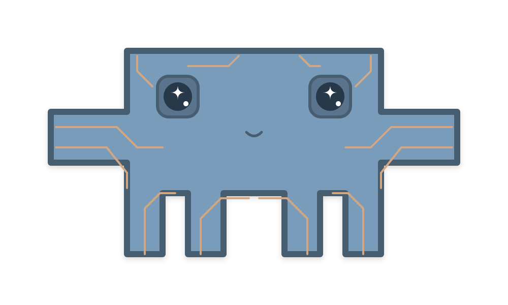

# MedhaSetu (🧠 मेधासेतु)

<p align="center">
  
</p>

MedhaSetu is a premium cognitive training and daily brain exercise web application designed specifically to promote mental agility, memory maintenance, and logical reasoning for senior citizens. Combining clean, accessible UX patterns with game-like consistency rewards, MedhaSetu empowers users to train their minds daily across 10 specialized categories.

---

## 🔗 Live Application
The live application is hosted on Firebase Hosting at:  
👉 **[https://medhasetu-agility.web.app](https://medhasetu-agility.web.app)**

---

## 🤖 About the Mascot: MedhaMascot
Meet **MedhaMascot**, the friendly cognitive training robot guide of MedhaSetu! Designed to make brain exercise engaging and approachable, MedhaMascot appears across the app to cheer users on, guide them through quiz loading screens, and celebrate streak achievements.

---

## ✨ Key Features

### 1. Dynamic Dashboard & Welcome Hero
* **Welcoming Presence**: Greets users by name, displays their active training streaks, and offers a primary Call-to-Action to begin daily exercises.
* **Quick Access Navigations**: Fluid shortcuts to core pages (Progress Statistics, Leaderboard, and Admin Seeding tools).

### 2. Subject-Matter Quizzes (10 Cognitive Categories)
Engage in 10-question daily quizzes covering diverse cognitive domains:
* 🎨 **Arts** — Visual culture, history, and classical arts.
* 🔢 **Mathematics** — Quick calculations, math puzzles, and numerical patterns.
* 🌍 **General Knowledge** — Global facts, science, and world history.
* 🗺️ **Indian History & Geography** — Landmarks, history, and physical geography.
* 🔬 **Science** — Astronomy, chemistry, physics, and biological trivia.
* 🧠 **Logical Reasoning** — Critical thinking, series completions, and puzzles.
* 💰 **Economics & Finance** — Financial literacy, savings concepts, and simple economics.
* 📚 **Literature & Classics** — Epics, prose, poetry, and linguistic masterpieces.
* 🎬 **Cinema & Nostalgia** — Music, classic films, and retro retro-trivia.
* 🗣️ **Word Power Puzzles** — Spelling checks, grammar, and language riddles.

### 3. Subject Accuracy Breakdown & Statistics
* **Performance Tracking**: Calculates user accuracy individually across each of the 10 subjects using the mathematical formula:
  $$\text{Subject Accuracy (\%)} = \left( \frac{\text{Total Correct Answers in Subject}}{\text{Total Questions Answered in Subject}} \right) \times 100$$
* **Visual Progress Bars**: Displays accuracy color tracks and lists quizzes taken count.
* **Historical Trend Line**: Renders an inline SVG line graph plotting overall accuracy percentage across the last 10 quiz sessions.

### 4. Daily Brain Training Streak System
* **Consistency Tracking**: Monitors daily quiz attempts, increasing user streaks for consecutive days of training.
* **Polite Expiration Modal**: Runs checks on dashboard mount. If the user misses a training day, their streak resets and they are greeted with a polite warning modal encouraging them to start fresh.

### 5. Leaderboard & community Circle
* **Community Ranking**: Lists users based on their active streaks and quizzes completed.
* **Milestones Goal Tracker**: Monitors collective milestones (e.g., total questions answered correctly as a community).

### 6. Email Verification Protection
* **Registration Validation**: Automatically dispatches a verification link on signup.
* **Navigation Interceptors**: Redirects unverified accounts to `/verify-email` with an info block prompting users to check their Spam/All Mail folders.

---

## 📱 Mobile-Native Responsive Design
MedhaSetu uses an adaptive design system built on **CSS3 Variables** and custom media overrides to feel like a native mobile app:
* **Edge-to-Edge Fitting**: On screens below `600px`, layout margins, shadows, and borders collapse. The application expands to fill 100% of the screen.
* **Tap-Target Optimization**: Buttons adjust to a minimum height of `48px` to comply with standard mobile ergonomics.
* **Single-Column Formats**: Category grids and cards collapse to single-column lists on mobile viewports to prevent awkward text-wrapping or button clipping.

---

## 🛠️ Technology Stack

| Layer | Technology | Description |
| :--- | :--- | :--- |
| **Frontend Core** | React 18 / Vite 5 | Fast, component-driven modular framework with Hot Module Reloading (HMR). |
| **Styling** | Vanilla CSS3 | Modular design tokens and media queries for layouts and fluid typography. |
| **Backend Database** | Firebase Firestore | Real-time synchronization of user profiles, scores, and questions. |
| **Authentication** | Firebase Auth | Secure signup, signin, password resets, Google OAuth, and email verification. |
| **Hosting** | Firebase Hosting | Scalable static web hosting on the `medhasetu-agility` domain. |
| **Icons** | Lucide React | Clean, scalable vector illustrations for dashboard controls. |
| **Animations** | CSS Animations / Canvas Confetti | Celebration effects and page transition fades. |

---

## 📁 Repository Directory Structure

```
MedhaSetu/
├── .firebase/                  # Firebase cache directory
├── dist/                       # Compiled production build directory (ignored by git)
├── public/                     # Static question JSON files and assets
│   ├── arts_questions.json
│   ├── maths_questions.json
│   ├── science questions.json
│   └── ...
├── src/
│   ├── components/
│   │   ├── Mascot.jsx          # Reusable robot mascot SVG renderer
│   │   └── PrivateRoute.jsx    # Custom route interceptor & verification guard
│   ├── contexts/
│   │   └── AuthContext.jsx     # User authentication and Firebase context
│   ├── pages/
│   │   ├── Dashboard.jsx       # Welcome cards, start quiz CTA, streak checkers
│   │   ├── CategorySelect.jsx  # 10 categories responsive selector list
│   │   ├── Quiz.jsx            # Quiz question renderer, results, and confetti modal
│   │   ├── Profile.jsx         # Detailed statistics charts, high scores, active badges
│   │   ├── SocialHub.jsx       # Milestones and Leaderboard pagination lists
│   │   ├── SeedDatabase.jsx    # Admin console to seed Firestore collections
│   │   ├── Login.jsx           # User sign-in & Google OAuth trigger
│   │   ├── Signup.jsx          # Register user with verification dispatch
│   │   ├── ForgotPassword.jsx  # Reset password request forms
│   │   └── VerifyEmail.jsx     # Email verification status manager
│   ├── firebase.js             # Firebase initialization file
│   ├── index.css               # Design system token setup and mobile overrides
│   └── main.jsx                # App entrypoint
├── firebase.json               # Firebase CLI configuration
├── index.html                  # Viewport meta tags and base HTML template
├── package.json                # Project script declarations & dependencies
└── vite.config.js              # Vite compiler configuration
```

---

## 🚀 Installation & Local Development

Follow these steps to run MedhaSetu on your local machine:

### 1. Prerequisites
Ensure you have **Node.js** (v18 or higher) and the **Firebase CLI** installed:
```bash
node --version
npm install -g firebase-tools
```

### 2. Clone the Repository
```bash
git clone https://github.com/SparshMishra09/MedhaSetu.git
cd MedhaSetu
```

### 3. Install Dependencies
```bash
npm install
```

### 4. Run the Dev Server
```bash
npm run dev
```
Open **[http://localhost:5173](http://localhost:5173)** in your browser to view the application.

---

## 💾 Admin Database Seeding

To populate Firestore with the 1,000+ cognitive questions:
1. Register an administrator account using the email: **`seniorsetu07@gmail.com`**.
2. Log in and navigate to the admin console: **`[Admin] Seed Database`** (or go directly to `/seed`).
3. Click **`Seed Data`**. This will parse all JSON data sets under `/public` and batch-write them to the `questions` and `categories` Firestore collections.

---

## 📦 Deployment to Firebase Hosting

To bundle the application and deploy updates to the live domain:

### 1. Build the Application
```bash
npm run build
```

### 2. Deploy to Firebase
```bash
firebase deploy --only hosting
```
The application will deploy to **`medhasetu-agility.web.app`**.
